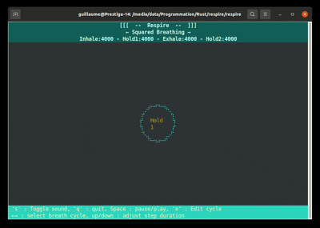

# Respire

Desktop Breathing App coded in Rust in ratatui

## Authors

- [@elevenjune](https://www.github.com/elevenjune)

## Demo

## Features

- Get a breathing break directly from your terminal
- 5 different breathing cycles that you can edit
- You can toggle the sound

## Controls

General Controls :
- Tab: Switch between sounds and scenes.
- s: enable/disable sound
- q: Quit the application.
- e: Enter edit Mode
- ←→: Switch cycle.

Edit Mode :
- ←→: Select Step to modify
- up/down: Adjust step duration (500ms)
- q: Quit the application.
- e: Exit edit Mode
